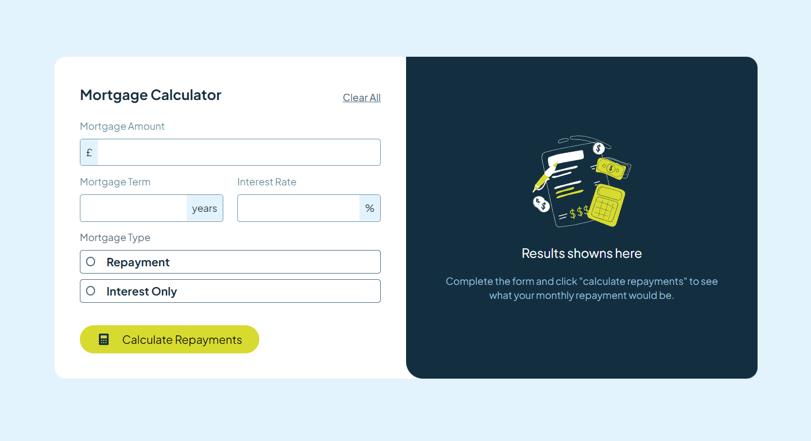
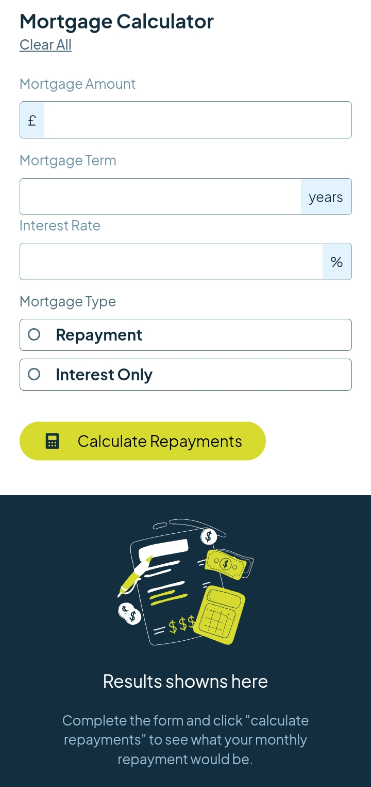
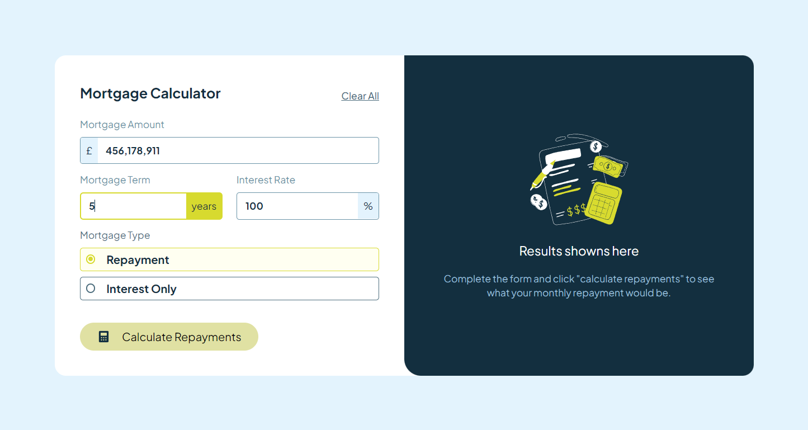
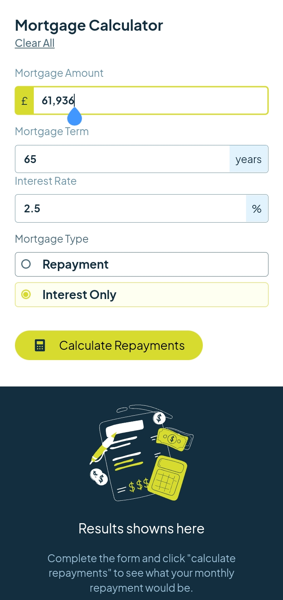
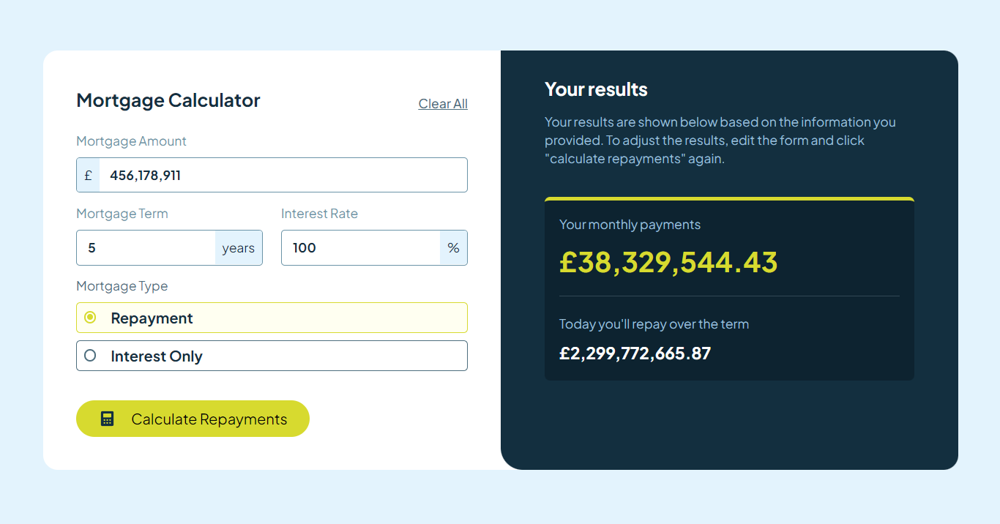
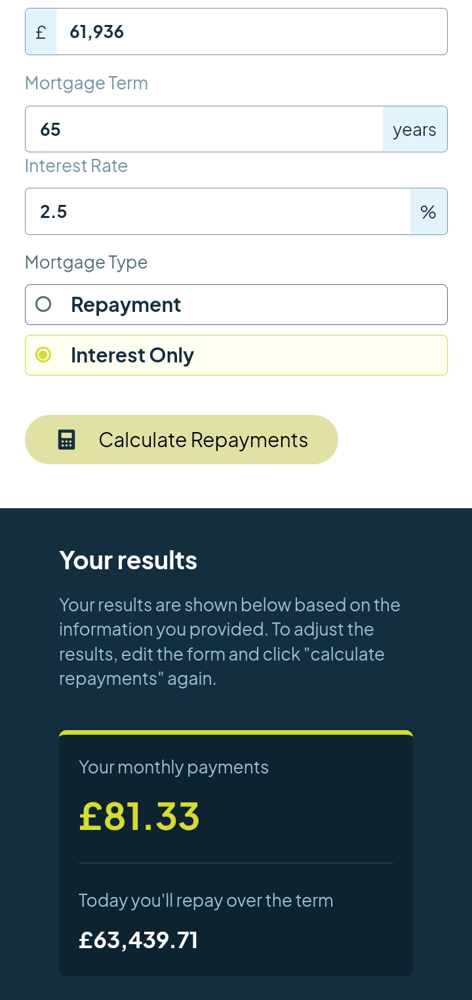
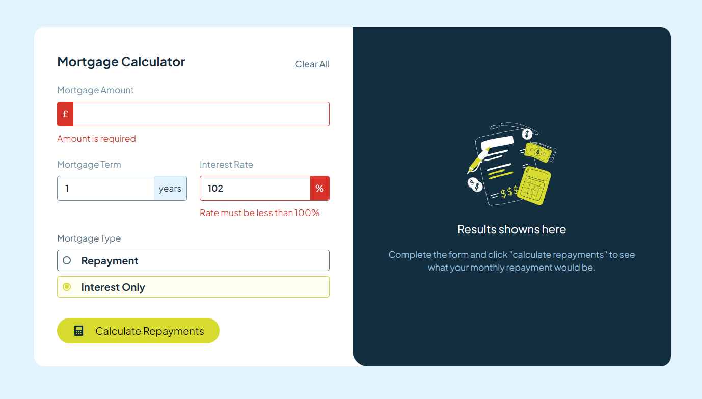
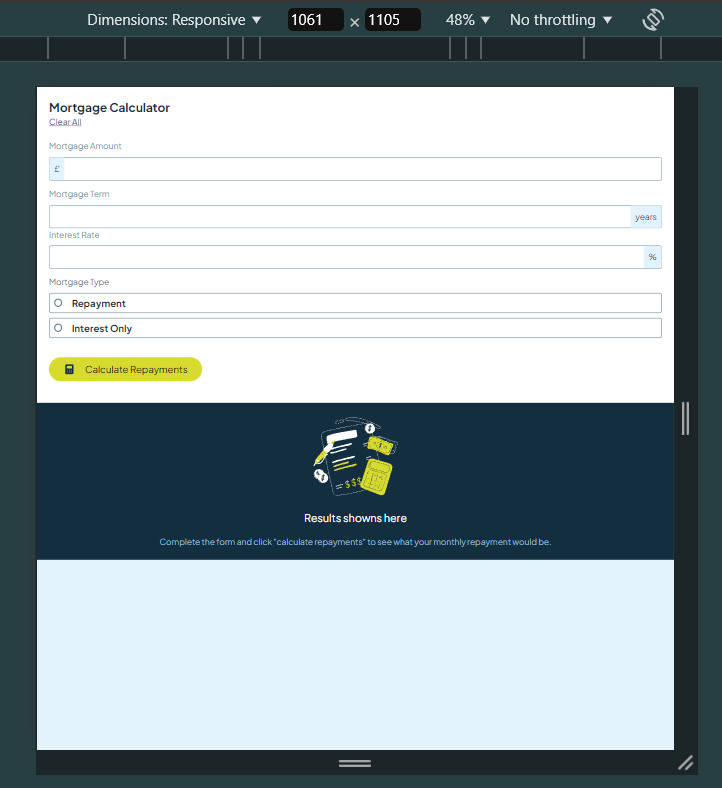

# Frontend Mentor - Mortgage repayment calculator solution

This is a solution to the [Mortgage repayment calculator challenge on Frontend Mentor](https://www.frontendmentor.io/challenges/mortgage-repayment-calculator-Galx1LXK73). Frontend Mentor challenges help you improve your coding skills by building realistic projects.

## Table of contents

- [Overview](#overview)
  - [The challenge](#the-challenge)
  - [Screenshot](#screenshot)
  - [Links](#links)
- [My process](#my-process)
  - [Built with](#built-with)
  - [What I learned](#what-i-learned)
  - [Continued development](#continued-development)
  - [Useful resources](#useful-resources)
- [Author](#author)

## Overview

### The challenge

Users should be able to:

- Input mortgage information and see monthly repayment and total repayment amounts after submitting the form
- See form validation messages if any field is incomplete
- Complete the form only using their keyboard
- View the optimal layout for the interface depending on their device's screen size
- See hover and focus states for all interactive elements on the page

### Screenshots

|     Label     |              Desktop               |                Mobile                |
| :-----------: | :--------------------------------: | :----------------------------------: |
|     Empty     |   |   |
| Active/Filled |    |    |
|    Results    |  |  |
|    Errors     |  |   |

### Links

- Solution URL: [GitHub Repo](https://github.com/Atatra/mortgage-calculator)
- Live Site URL: [Mortgage Calculator Vercel](https://mortgage-calculator-rust.vercel.app/)

## My process

### Built with

- Semantic HTML5 markup
- CSS custom properties & TailwindCSS
- Flexbox
- CSS Grid
- [React](https://reactjs.org/) - JS library
- [Next.js](https://nextjs.org/) - React framework
- [Zod](https://zod.dev/) - TypeScript-first schema validation - For data validation
- [TailwindCSS](https://tailwindcss.com/) - For styles

### What I learned

- How to use Zod for form validation client-side.

- I'm starting to understand how `position: relative` affect children's behaviours, and what `position: absolute` really means.

- How to make the form completeable only with keyboard. I only needed to add the proper markups.

- That it was fairly easy to format a user input (1000 -> 1,000). But there were some exceptions to handle though, which led to unwanted behaviour that I didn't thought earlier...

  For instance, if I knew that the behaviour of my `Amount Input` would be so different from the other two, I would never have factorized them in `Input.tsx`.

### Continued development

- I only started Mobile-first workflow halfway through the project, I should have done it earlier.

- To correctly format and show the amount's input (1000 -> 1,000) I had to change the input type from `number` to `text`. Not only does it pose an accessibilty issue on mobile, but it also made it possible to write characters. For desktop I used an event handler to allow user to type number, 'CTRL/CMD+A', 'Enter/Backward' only. But for mobile I couldn't prevent side-effects. Fortunately, there is still Zod's validation so user can't submit NaN things. So next time I'll probably use a dedicated library like CleaveJs, or at least organize better to make it easier to code the intended behavior.

- I probably should use CSS modules, it would prevent copy pasting the same properties too many times, and would make the code more readable since my TailwindCSS classes are not organized at all (no proper ordering on attributes).

- I had trouble with changing the color of the Radio Button, it seems like it's not possible since it is browser-dependent. So I had to replace it with two divs painfully positioned with `position: relative` and `position: absolute`. Which makes it not fully responsive, the inner circle might be misplaced based on the user's browser and screen settings. Next time I'll probably use two images instead (checked, not_checked).

- I need to find a way to crop the content when resizing the page from the left. Right now the content wraps vertically until it overflows its respective container.

- There is also an issue on low width screen (<1100px), the result's background doesn't fit the remaining height (since I put a fixed height).
  I tried, but I couldn't make it grow to fit the whole screen. So the `<main>`'s background is visible.

  

### Useful resources

- [MDN Web Docs](https://developer.mozilla.org/) - [Flexbox Froggy](https://flexboxfroggy.com/) - This helped me for semantic HTML, flexbox, and grid, because I don't know what I'm doing.
- [Zod Docs](https://zod.dev/) - [Zod Integration](https://www.youtube.com/watch?v=9UCoVM6QhnU) - For the same reason as above.

## Author

- Frontend Mentor - [@Atatra](https://www.frontendmentor.io/profile/Atatra)
